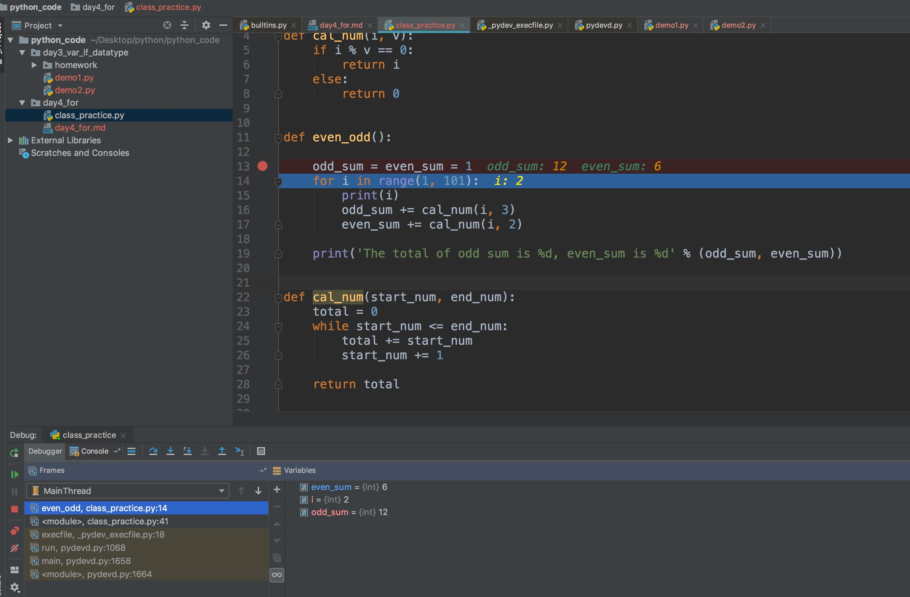

## Python 循环

### while loop

> python while 可以和 else 搭配使用

> continue语句被用来告诉Python跳过当前循环块中的剩余语句，然后继续进行下一轮循环。

> break 结束循环

> * for 循环 while 循环有 else, 在 break 时不执行

```python3
count = 0
while count < 5:
   print (count, " 小于 5")
   count = count + 1
else:
   print (count, " 大于或等于 5")
```

- 当循环只有一条语句时，应该将 while 和 语句放在
```python3
while (flag): print ('welcome!')
```

### for loop

```

for <variable> in <sequence>:
    <statements>
else:
    <statements>

```

### range 函数

- 指定区域
- 指定步长

  - 遍历数组

  ```python3
  a = ['Google', 'Baidu', 'Runoob', 'Taobao', 'QQ']
  for i in range(len(a)):
      print(i, a[i])
  ```

```python3
for i in range(0, 10, 3) :
    print(i)

# output 0 3 6 9    

```

## python debug





## Tip

- atom a 创建文件， Shift + a 创建文件夹

- python 中的 三目

```python
expr=判断表达式 and expr1 or expr2
```

- and 返 false 或值， or 返两个值

## Faq

- \#!/usr/bin/python3 作用

: 找 python 解释器 未定义

- 为何 break 都不讲

- Python pass是空语句，是为了保持程序结构的完整性。

- 在Linux/Unix系统中，你可以在脚本顶部添加以下命令让Python脚本可以像SHELL脚本一样可直接执行：

  表示从 "PATH 环境变量"中查找 python3 解释器的位置, 路径没有被写死, 而是在"环境变量"中寻找 python3 解释器的安装路径, 再调用该路径下的解释器来执行脚本
```sh

$ chmod +x hello.py

```
